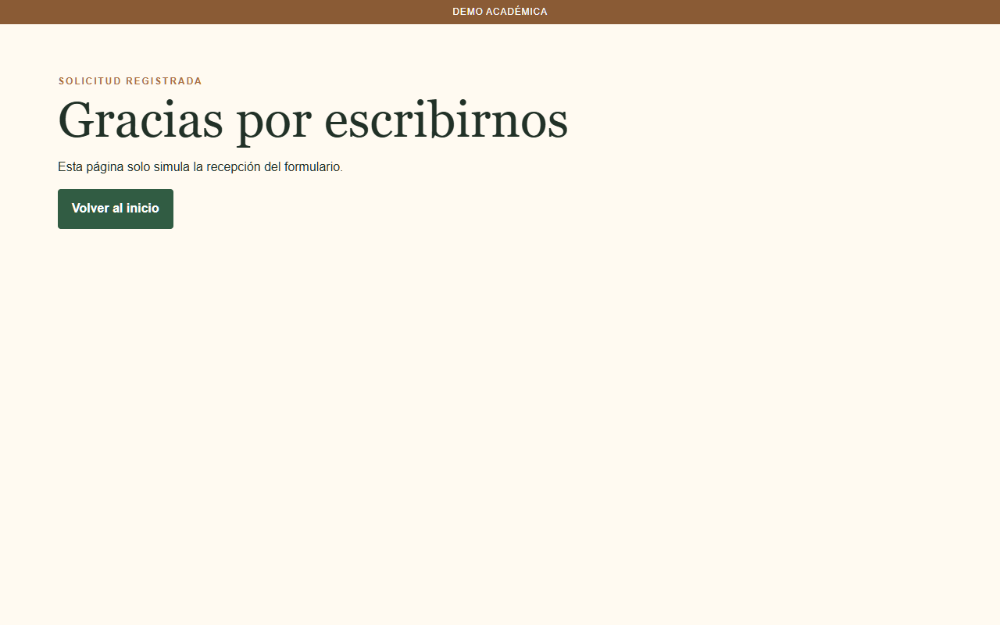
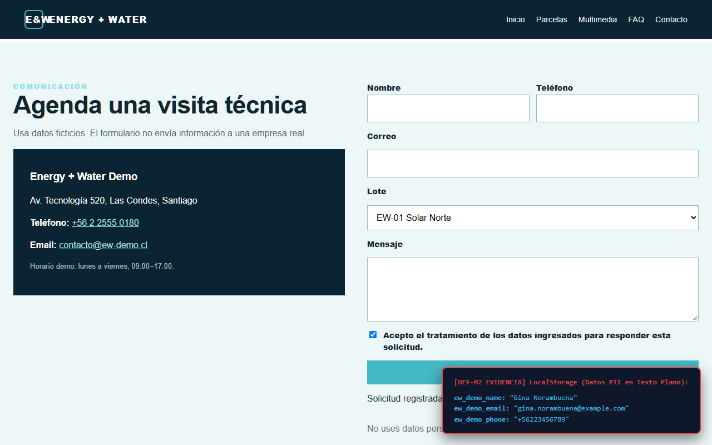
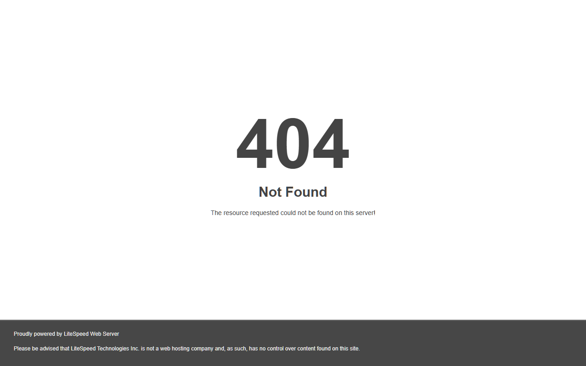
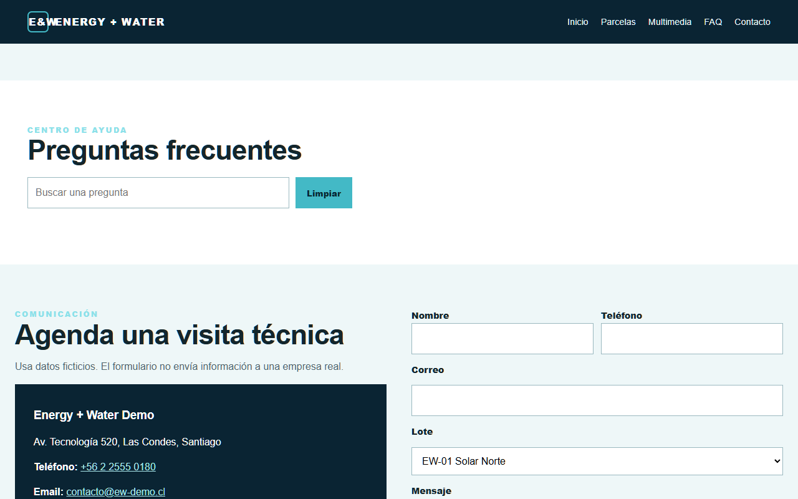
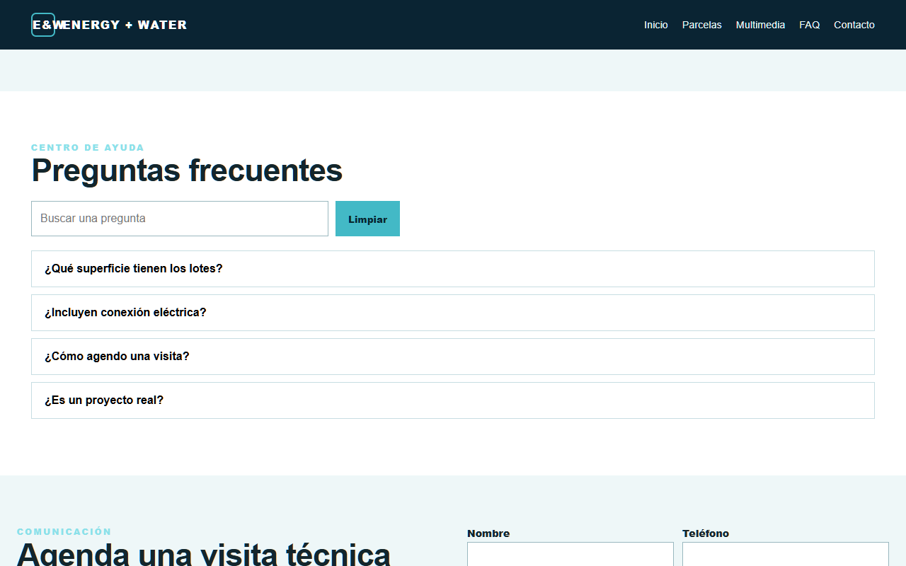
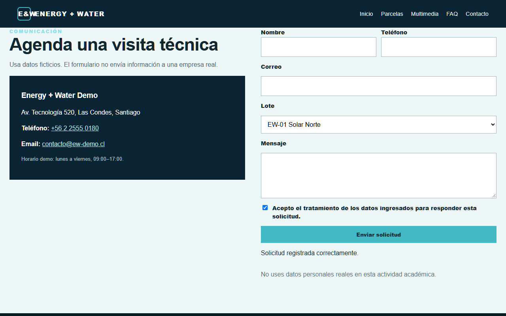

# REPORTE DETALLADO DE DEFECTOS (BUG REPORT)
**Asignatura:** Testing aplicado al desarrollo de sistemas  
**Estándar de Documentación:** IEEE 829 / ISTQB Standard Defect Reporting  
**Total Defectos Documentados:** 6 defectos de alto impacto (Funcionales, No Funcionales y de Seguridad)

---

### DEF-01: Exposición de datos personales sensibles (PII) mediante método HTTP GET en formulario de contacto
* **ID:** DEF-01 (DEF-TS-06)
* **Aplicación:** TerraSol Parcelas
* **URL:** `https://clinicatecnologica.cl/terrasol/contacto.html`
* **Historia de Usuario:** HU06 - Navegación Segura / HU05 - Formulario de Solicitud
* **Clasificación:** Seguridad / Vulnerabilidad Web
* **Severidad:** **Crítica**
* **Prioridad:** **Alta (P1)**
* **Vulnerabilidad CWE/OWASP:** CWE-598 (Information Exposure Through Query Strings in GET Request) / OWASP Top 10 - A01: Broken Access Control & Cryptographic Failures.

#### 1. Descripción del Defecto:
El formulario de contacto y solicitud de visita está configurado con el método HTTP GET (`<form action="gracias.html" method="get">`). Al ser enviado por el usuario, todos los datos personales sensibles (nombre, teléfono, correo electrónico, selección de parcela y mensaje) son concatenados en texto plano en la barra de direcciones como parámetros de consulta (Query String).

#### 2. Pasos para Reproducir:
1. Acceder a `https://clinicatecnologica.cl/terrasol/contacto.html`.
2. Ingresar datos en los campos:
   * Nombre: `Gina Norambuena`
   * Teléfono: `+56912345678`
   * Correo: `gina.norambuena@example.cl`
   * Parcela: `Coihue`
   * Mensaje: `Interesada en coordinar visita`
3. Marcar el checkbox de aceptación de privacidad.
4. Presionar el botón "Enviar solicitud".
5. Observar la URL generada en la página de destino `gracias.html`.

#### 3. Resultado Esperado:
Los datos personales deben ser transmitidos de forma confidencial en el cuerpo de una petición HTTP cifrada utilizando el método **POST** hacia un endpoint seguro (`action="/api/contacto" method="POST"`), protegiendo la información de fugas en historiales o logs.

#### 4. Resultado Obtenido:
La información viaja visible en la URL:
`https://clinicatecnologica.cl/terrasol/gracias.html?nombre=Gina+Norambuena&telefono=%2B56912345678&email=gina.norambuena%40example.cl&parcela=Coihue&mensaje=Interesada+en+coordinar+visita&privacidad=acepto&origen=demo-terrasol`

#### 5. Impacto en el Negocio y Seguridad:
#### 5. Evidencia Visual Capturada:


#### 6. Impacto en el Negocio y Seguridad:
* Violación directa a la Ley N° 19.628 sobre Protección de la Vida Privada (Chile).
* Exposición permanente de PII en el historial de navegación del cliente, cachés locales, logs de servidores web intermedios (proxies) y cabeceras HTTP `Referer`.

#### 6. Recomendación Técnica de Corrección:
#### 7. Recomendación Técnica de Corrección:
Modificar el método del formulario a POST y apuntar a un controlador seguro con validación de tokens CSRF:
```html
<!-- Corrección en contacto.html -->
<form action="/api/solicitudes" method="POST">
  <input type="hidden" name="csrf_token" value="{{ csrf_token }}">
  <!-- campos del formulario -->
  <button class="btn" type="submit">Enviar solicitud</button>
</form>
```

---

### DEF-02: Persistencia insegura de Información Personal (PII) en LocalStorage sin cifrado
* **ID:** DEF-02 (DEF-EW-07)
* **Aplicación:** Energy & Water EcoParcelas
* **URL:** `https://clinicatecnologica.cl/energyandwater/index.html#contacto`
* **Historia de Usuario:** HU06 - Navegación Segura / HU05 - Formulario de Solicitud
* **Clasificación:** Seguridad / Privacidad de Datos
* **Severidad:** **Alta**
* **Prioridad:** **Alta (P1)**
* **Vulnerabilidad CWE:** CWE-312 (Cleartext Storage of Sensitive Information) / CWE-922 (Insecure Storage of Sensitive Information).

#### 1. Descripción del Defecto:
El script JavaScript del formulario de solicitud intercepta el evento `submit` y almacena directamente en texto plano los datos personales del solicitante (`ew_demo_name`, `ew_demo_email`, `ew_demo_phone`) en el almacenamiento local del navegador (`localStorage`), sin cifrado, sin sanitización y sin conexión a un servicio backend protegido.

#### 2. Pasos para Reproducir:
1. Navegar a `https://clinicatecnologica.cl/energyandwater/#contacto`.
2. Completar los campos del formulario con datos personales.
3. Hacer clic en "Enviar solicitud".
4. Abrir las herramientas de desarrollo del navegador (DevTools -> F12).
5. Dirigirse a la pestaña **Application -> Storage -> Local Storage -> https://clinicatecnologica.cl**.
6. Inspeccionar las claves y valores almacenados.

#### 3. Resultado Esperado:
El frontend no debe almacenar datos de contacto personales de manera persistente en `localStorage` del cliente. Los datos deben ser sanitizados y enviados a una API REST corporativa mediante HTTPS con autenticación y cifrado en tránsito.

#### 4. Resultado Obtenido:
Se evidencian las entradas de almacenamiento local en texto sin formato:
* `ew_demo_email`: `gina.norambuena@example.com`
* `ew_demo_name`: `Gina Norambuena`
* `ew_demo_phone`: `+56223456789`

#### 5. Impacto en el Negocio y Seguridad:
#### 5. Evidencia Visual Capturada:


#### 6. Impacto en el Negocio y Seguridad:
Cualquier vulnerabilidad de Cross-Site Scripting (XSS) o extensión de navegador con permisos de lectura puede sustraer la información personal de los clientes de manera silenciosa, ya que `localStorage` no posee protección mediante la flag `HttpOnly`.

#### 6. Recomendación Técnica de Corrección:
#### 7. Recomendación Técnica de Corrección:
Eliminar el guardado en `localStorage` y conectar el envío a una llamada `fetch` asíncrona hacia el backend con sanitización:
```javascript
// Corrección en assets/app.js
form.addEventListener('submit', async (e) => {
  e.preventDefault();
  const formData = {
    nombre: document.getElementById('name').value.trim(),
    email: document.getElementById('email').value.trim(),
    telefono: document.getElementById('phone').value.trim(),
    lote: document.getElementById('lot').value,
    mensaje: document.getElementById('message').value.trim()
  };

  try {
    const res = await fetch('/api/visitas', {
      method: 'POST',
      headers: { 'Content-Type': 'application/json' },
      body: JSON.stringify(formData)
    });
    if (res.ok) {
      document.getElementById('form-result').textContent = 'Solicitud registrada correctamente.';
      form.reset();
    }
  } catch (err) {
    document.getElementById('form-result').textContent = 'Error al registrar solicitud.';
  }
});
```

---

### DEF-03: Enlace roto con código de error HTTP 404 en el menú de navegación de FAQ
* **ID:** DEF-03 (DEF-TS-01)
* **Aplicación:** TerraSol Parcelas
* **URL:** `https://clinicatecnologica.cl/terrasol/faq.html`
* **Historia de Usuario:** HU01 - Navegación Intuitiva
* **Clasificación:** Funcional / Enlaces y Arquitectura de Navegación
* **Severidad:** **Alta**
* **Prioridad:** **Alta (P1)**

#### 1. Descripción del Defecto:
En la barra de navegación superior de la página `faq.html`, el enlace correspondiente al catálogo de parcelas apunta a la ruta relativa `parcela.html` (en singular), la cual no existe en el servidor, provocando una pantalla de error **HTTP 404 Not Found**.

#### 2. Pasos para Reproducir:
1. Ingresar a `https://clinicatecnologica.cl/terrasol/faq.html`.
2. Posicionar el cursor sobre el menú de navegación principal en la cabecera.
3. Hacer clic en la opción "Parcelas".
4. Observar la respuesta del servidor web.

#### 3. Resultado Esperado:
El enlace debe conducir a la página funcional del catálogo: `https://clinicatecnologica.cl/terrasol/parcelas.html` con código de respuesta **HTTP 200 OK**.

#### 4. Resultado Obtenido:
El navegador intenta cargar `https://clinicatecnologica.cl/terrasol/parcela.html` y el servidor LiteSpeed retorna el error `HTTP/1.1 404 Not Found`.

#### 5. Impacto en el Negocio:
#### 5. Evidencia Visual Capturada:


#### 6. Impacto en el Negocio:
Ruptura crítica del flujo de navegación (Dead End). El usuario que consulta dudas frecuentes no puede regresar a ver las parcelas desde el menú, deteriorando la conversión y la experiencia de usuario (UX).

#### 6. Recomendación Técnica de Corrección:
#### 7. Recomendación Técnica de Corrección:
Corregir la etiqueta ancla en el código fuente de `faq.html`:
```html
<!-- Código erróneo en faq.html -->
<li><a href="parcela.html">Parcelas</a></li>

<!-- Código corregido -->
<li><a href="parcelas.html">Parcelas</a></li>
```

---

### DEF-04: Mal funcionamiento del buscador FAQ y bloqueo de restauración en botón "Limpiar"
* **ID:** DEF-04 (DEF-EW-08)
* **Aplicación:** Energy & Water EcoParcelas
* **URL:** `https://clinicatecnologica.cl/energyandwater/#faq`
* **Historia de Usuario:** HU07 - Preguntas Frecuentes
* **Clasificación:** Funcional / JavaScript & Usabilidad
* **Severidad:** **Media**
* **Prioridad:** **Media (P2)**

#### 1. Descripción del Defecto:
El motor de búsqueda de preguntas frecuentes presenta dos fallos interactivos:
1. El filtrado `item.innerText.includes(term)` es sensible a mayúsculas y acentos diacríticos (tildes). Si el usuario busca "¿Que" (sin tilde), el buscador oculta todas las preguntas porque en el texto dice "¿Qué".
2. El botón "Limpiar" posee un controlador en línea `onclick="document.getElementById('faq-search').value=''"` que solo limpia el valor visual de la caja de texto pero **no despacha el evento 'input'**. Como consecuencia, las preguntas permanecen ocultas con `display: none` de forma irreversible.

#### 2. Pasos para Reproducir:
1. Acceder a `https://clinicatecnologica.cl/energyandwater/#faq`.
2. En el input de búsqueda escribir `¿Que` (sin tilde).
3. Verificar que todas las preguntas desaparecen del panel.
4. Presionar el botón "Limpiar".
5. Observar el estado de la lista de preguntas.

#### 3. Resultado Esperado:
* La búsqueda debe ser flexible (case-insensitive y normalizada sin tildes).
* Al presionar el botón "Limpiar", el campo debe quedar en blanco y todas las preguntas frecuentes deben volver a desplegarse de inmediato.

#### 4. Resultado Obtenido:
El campo de texto se vacía, pero la interfaz permanece en blanco con todas las preguntas ocultas, requiriendo recargar la página completa para restaurar la vista.

#### 5. Causa Raíz Técnica:
#### 5. Evidencia Visual Capturada:


#### 6. Causa Raíz Técnica:
Modificar la propiedad `.value` de un elemento `HTMLInputElement` vía script no desencadena programáticamente los escuchadores de eventos asociados a `'input'`.

#### 6. Recomendación Técnica de Corrección:
#### 7. Recomendación Técnica de Corrección:
Normalizar la búsqueda y disparar el evento o invocar la función de renderizado en `assets/app.js`:
```javascript
// Corrección en assets/app.js
const search = document.getElementById('faq-search');
const clearBtn = document.querySelector('.faq-tools button');

function filtrarFAQ() {
  const term = search.value.toLowerCase().normalize("NFD").replace(/[\u0300-\u036f]/g, "");
  document.querySelectorAll('.faq-item').forEach(item => {
    const texto = item.innerText.toLowerCase().normalize("NFD").replace(/[\u0300-\u036f]/g, "");
    item.style.display = texto.includes(term) ? '' : 'none';
  });
}

if (search) {
  search.addEventListener('input', filtrarFAQ);
}

if (clearBtn) {
  clearBtn.addEventListener('click', () => {
    search.value = '';
    filtrarFAQ(); // Restaura la visibilidad de todas las preguntas
  });
}
```

---

### DEF-05: Inconsistencia en selectores de acordeón FAQ que impide el despliegue de respuestas
* **ID:** DEF-05 (DEF-EW-09 / DEF-TS-07)
* **Aplicación:** Energy & Water EcoParcelas / TerraSol Parcelas
* **URL:** `https://clinicatecnologica.cl/energyandwater/#faq` y `https://clinicatecnologica.cl/terrasol/faq.html`
* **Historia de Usuario:** HU07 - Preguntas Frecuentes
* **Clasificación:** Funcional / Interfaz de Usuario
* **Severidad:** **Media**
* **Prioridad:** **Media (P2)**

#### 1. Descripción del Defecto:
En ambos sitios web, los botones de ciertas preguntas frecuentes poseen atributos de vinculación que no concuerdan con el identificador `id` del elemento contenedor de la respuesta:
* **En Energy & Water:** El botón "¿Cómo agendo una visita?" define `data-target="answer-visita"`, pero el panel de respuesta tiene `id="a3"`.
* **En TerraSol:** El botón "¿Existe financiamiento?" define `aria-controls="faq-financiamiento"`, pero el panel de respuesta tiene `id="f3"`.

#### 2. Pasos para Reproducir:
1. En Energy & Water, bajar a la sección `#faq`.
2. Hacer clic sobre la tercera pregunta "¿Cómo agendo una visita?".
3. En TerraSol, ingresar a `faq.html`.
4. Hacer clic sobre la tercera pregunta "¿Existe financiamiento?".

#### 3. Resultado Esperado:
Al pulsar la pregunta, la función JavaScript debe encontrar el elemento del DOM correspondiente y aplicarle la clase de visibilidad (`show` u `open`), mostrando la respuesta al usuario.

#### 4. Resultado Obtenido:
Al hacer clic no ocurre absolutamente nada visualmente. En la función `document.getElementById(btn.dataset.target)` se evalúa `null` y la ejecución retorna inmediatamente sin conmutar la visibilidad.

#### 5. Recomendación Técnica de Corrección:
#### 5. Evidencia Visual Capturada:


#### 6. Recomendación Técnica de Corrección:
Hacer coincidir los atributos de control con el `id` real del contenedor en el archivo HTML:
```html
<!-- En Energy & Water (index.html): -->
<div class="faq-item">
  <button class="faq-q" data-target="a3">¿Cómo agendo una visita?</button>
  <div class="faq-a" id="a3">Completa el formulario de contacto y selecciona el lote de interés.</div>
</div>

<!-- En TerraSol (faq.html): -->
<div class="faq-item">
  <button data-faq aria-expanded="false" aria-controls="f3">¿Existe financiamiento?<span>+</span></button>
  <div class="faq-answer" id="f3">En esta demo no se realizan operaciones comerciales reales.</div>
</div>
```

---

### DEF-06: Ausencia total de validación y simulación falsa en formulario de solicitud de visita
* **ID:** DEF-06 (DEF-EW-05)
* **Aplicación:** Energy & Water EcoParcelas
* **URL:** `https://clinicatecnologica.cl/energyandwater/#contacto`
* **Historia de Usuario:** HU05 - Formulario de Solicitud
* **Clasificación:** Funcional / Integridad de Datos
* **Severidad:** **Alta**
* **Prioridad:** **Alta (P2)**

#### 1. Descripción del Defecto:
El formulario `#visit-form` cuenta con la directiva `<form id="visit-form" novalidate>` que deshabilita las restricciones nativas del navegador, y sus inputs de entrada carecen de atributos obligatorios (`required`, `type="email"`). Además, el listener en `assets/app.js` no valida el contenido antes de procesar el formulario, permitiendo que el usuario envíe formularios completamente en blanco o con caracteres sin sentido, respondiendo falsamente con el mensaje de confirmación "Solicitud registrada correctamente.".

#### 2. Pasos para Reproducir:
1. Ingresar a `https://clinicatecnologica.cl/energyandwater/#contacto`.
2. Sin escribir ningún dato en los campos Nombre, Teléfono, Correo ni Mensaje, hacer clic directamente en "Enviar solicitud".
3. Observar la retroalimentación del sistema.

#### 3. Resultado Esperado:
#### 4. Resultado Esperado:
El formulario debe validar que los campos mandatorios contengan información válida. Debe bloquear la sumisión y destacar en color rojo los campos requeridos vacíos.

#### 4. Resultado Obtenido:
#### 5. Resultado Obtenido:
El sistema acepta el formulario vacío, limpia los inputs y publica el mensaje: *"Solicitud registrada correctamente."*, almacenando cadenas vacías en la persistencia.

#### 5. Impacto en el Negocio:
#### 6. Evidencia Visual Capturada:


#### 7. Impacto en el Negocio:
Generación de leads basura, saturación de bases de datos con registros vacíos y desconfianza del usuario al no existir confirmación fidedigna de recepción de datos.

#### 6. Recomendación Técnica de Corrección:
#### 8. Recomendación Técnica de Corrección:
Remover el atributo `novalidate`, utilizar tipos de input semánticos y añadir validación lógica en JavaScript:
```html
<!-- En index.html -->
<form id="visit-form">
  <input id="name" name="name" required minlength="3">
  <input id="phone" name="phone" type="tel" required pattern="^[+]*[0-9]{8,12}$">
  <input id="email" name="email" type="email" required>
  <!-- ... -->
</form>
```

